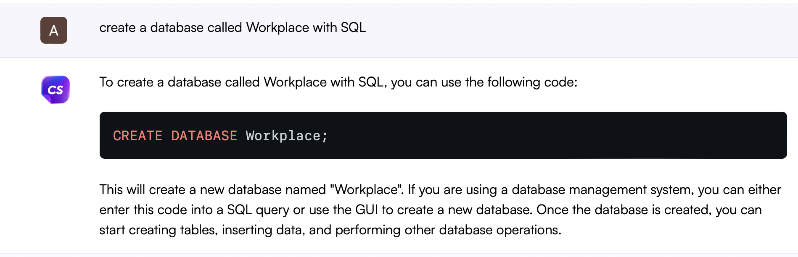
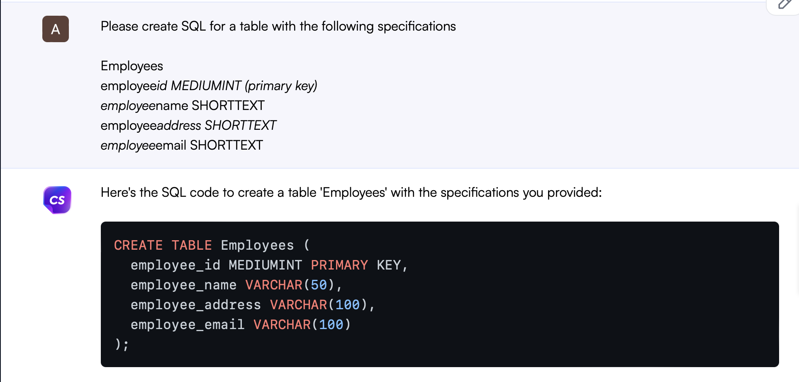
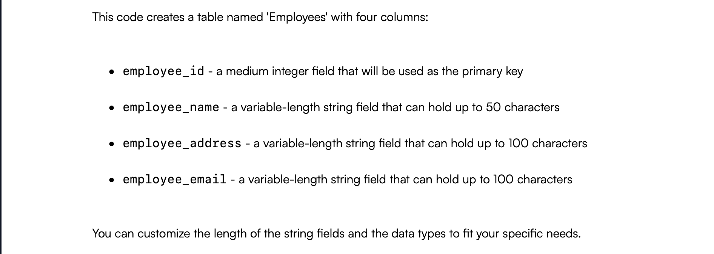
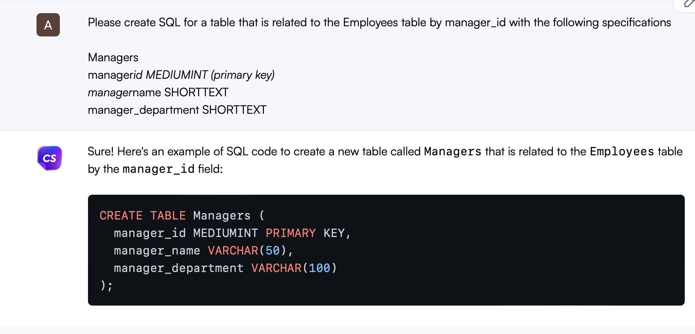
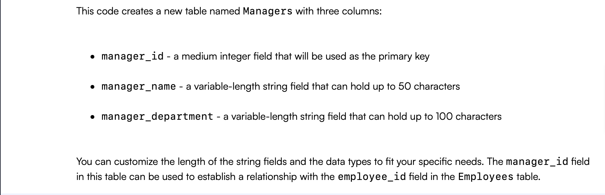
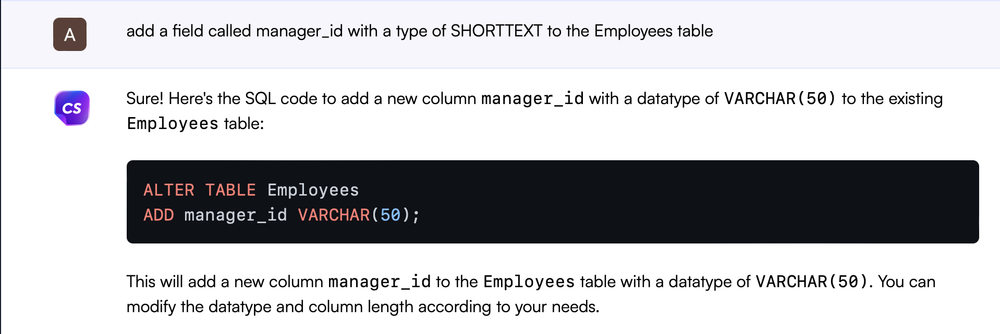
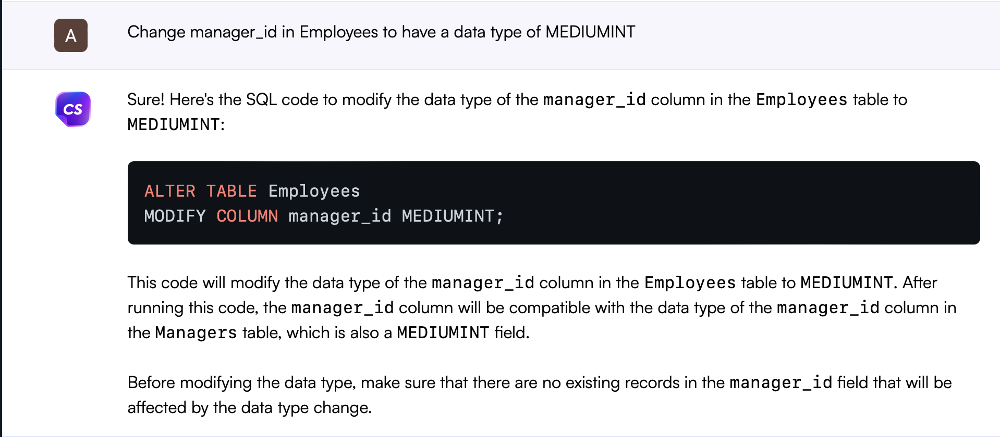
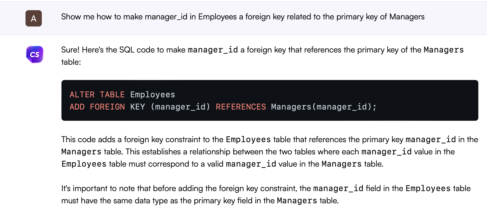

# dba120-exam2
Using AI to create a database

## Initializing/Creating Database

## Adding Employees table

## Adding Managers table

## Adding manager_id to Employees

## Changing manager_id to match field type before creating foreign key

## Relate tables with manager_id foreign key

## Populate tables with data

