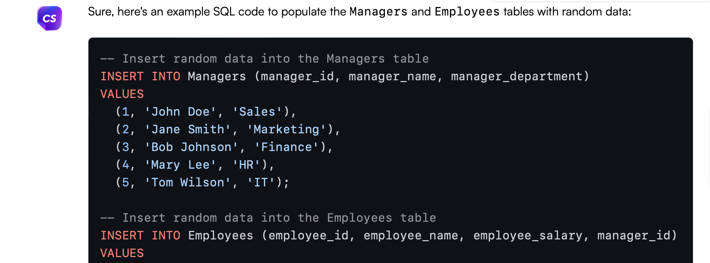
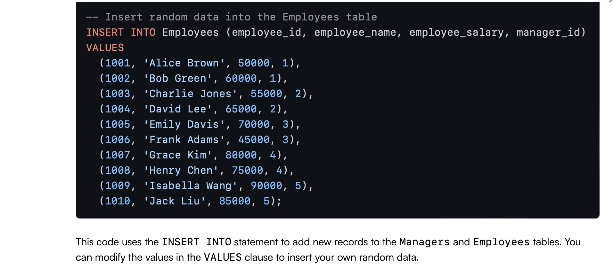

# dba120-exam2
Using AI to create a database

## Initializing/Creating Database

Ask AI to create a databse to contain your tables/data

## Adding Employees table

Add your first table by giving field names and data types

## Adding Managers table

Add more tables as necessary using the same request structure

## Adding manager_id to Employees

Ensure field exists to relate data

## Changing manager_id to match field type before creating foreign key

Ensure field types match so foreign key and primary key can be used to connect tables

## Relate tables with manager_id foreign key

Connect tables to show relationship

## Populate tables with data

Create data for the database created

AI has trouble with consistency sometimes. Not all fields are exactly correct here, but its response could help with constructing data if in need of assistance with SQL syntax

